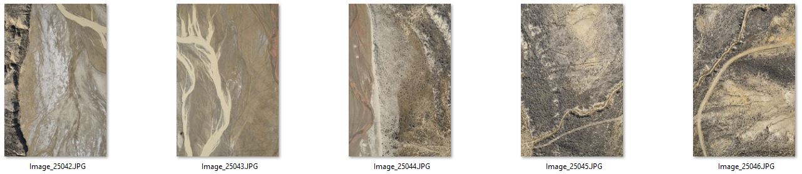
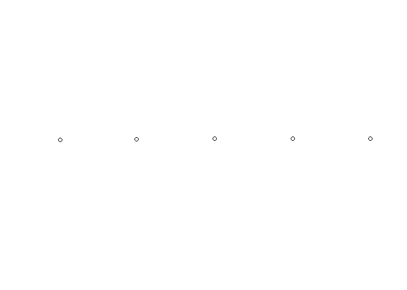
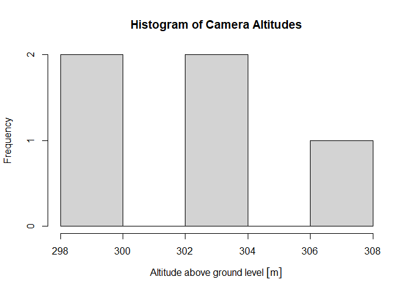
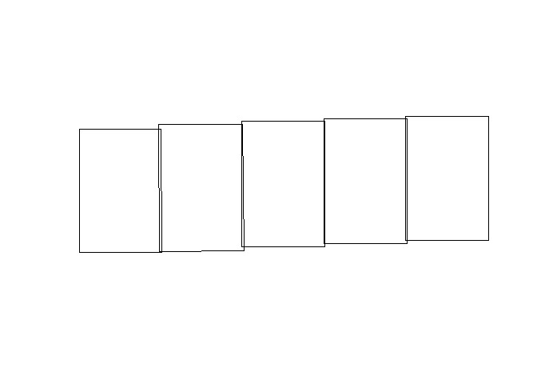

# aerialPhotoFrame


Create a spatial polygon (`sf`) delineating the ground extent (AKA
wireframe or field of view) of a nadir photo taken from an airplane or
drone. Useful in approximating the locations and total area sampled in a
series of aerial photos.

## How to Install

From GitHub:

    remotes::install_github("https://github.com/WyoGFD/aerialPhotoFrame")

## Input

- Photos which contain EXIF metadata specifying the GPS location of the
  camera (X, Y, Z coordinates) when the photo was taken, the photo
  timestamp, and information about the photo’s aspect ratio and field of
  view with the camera’s sensor dimensions and lens focal length.

## Output

- An `sf` object approximating the area photographed in each photo.

## General Workflow

- `extractPoints` - Extract camera location (3D point) from photos, and
  approximate the direction of travel (and therefore photo orientation)
  from the sequence of photo locations.
- `calcAlt` - Download a digital elevation model (DEM) for the study
  area and calculate the camera’s approximate altitude above ground
  level based on the camera’s altitude above mean sea level (what the
  GPS records) and the ground elevation (from the DEM).
- `wireFrame` - Use EXIF-provided camera and lens specifications,
  altitude, and direction of travel to construct rectangular wireframe
  of each photo’s ground extent

## Key Dependencies

- The EXIF data associated with photos is read using the `exifr`
  package, which calls [ExifTool](https://exiftool.org/)
- The DEM for the study area is downloaded using the `FedData` package,
  which obtains DEMs from the [USGS National Elevation Dataset
  (NED)](https://www.usgs.gov/3d-elevation-program).

## Example

The package contains 5 example aerial photos collected in Southern
Wyoming in February 2025. They are located in the `extdata` folder of
the installed package (e.g.,
`C:/Users/jadcarlisle/Documents/R/aerialPhotoFrame/extdata`).



``` r
# Load package
library(aerialPhotoFrame)

# Path to installed package to access example images
packagePath <- "C:/Users/jadcarlisle/Documents/R/aerialPhotoFrame"

# Extract camera location from photos
pts <- extractPoints(file.path(packagePath,
                               "extdata"))
```

    Date in ISO8601 format; converting timezone from UTC to "MST".

``` r
# View first few rows
head(data.frame(sf::st_drop_geometry(pts)))
```

                             FileName
    1 EL430_2025_00501_2025-02-23.JPG
    2 EL430_2025_00502_2025-02-23.JPG
    3 EL430_2025_00503_2025-02-23.JPG
    4 EL430_2025_00504_2025-02-23.JPG
    5 EL430_2025_00505_2025-02-23.JPG
                                                                                     SourceFile
    1 C:/Users/jadcarlisle/Documents/R/aerialPhotoFrame/extdata/EL430_2025_00501_2025-02-23.JPG
    2 C:/Users/jadcarlisle/Documents/R/aerialPhotoFrame/extdata/EL430_2025_00502_2025-02-23.JPG
    3 C:/Users/jadcarlisle/Documents/R/aerialPhotoFrame/extdata/EL430_2025_00503_2025-02-23.JPG
    4 C:/Users/jadcarlisle/Documents/R/aerialPhotoFrame/extdata/EL430_2025_00504_2025-02-23.JPG
    5 C:/Users/jadcarlisle/Documents/R/aerialPhotoFrame/extdata/EL430_2025_00505_2025-02-23.JPG
                 DateTime ImageWidth ImageHeight Megapixels FocalLength
    1 2025-02-23 17:07:12       8256        5504   45.44102          50
    2 2025-02-23 17:07:14       8256        5504   45.44102          50
    3 2025-02-23 17:07:15       8256        5504   45.44102          50
    4 2025-02-23 17:07:17       8256        5504   45.44102          50
    5 2025-02-23 17:07:19       8256        5504   45.44102          50
                         FOV RollAngle PitchAngle  YawAngle      Bearing
    1 39.597786155869 0.0072  33.61902  -88.83807 -89.25552 91.00436 [°]
    2 39.597786155869 0.0072  -9.67584  -88.88766 -90.06952 91.16169 [°]
    3 39.597786155869 0.0072 -24.80252  -88.62881 -90.47284 91.53217 [°]
    4 39.597786155869 0.0072  -3.85016  -87.28128 -90.11310 91.83444 [°]
    5 39.597786155869 0.0072 -26.84106  -88.65485 -90.51263 91.83444 [°]

``` r
# Map
plot(sf::st_geometry(pts))
```



``` r
# Add altitude, specifically above-ground-level
pts <- calcAltitude(pts)
```

    Area of interest includes 1 NED tiles.

    (Down)Loading NED tile for 42N and 109W.

``` r
# View first few rows
# Note new columns starting within elev
head(data.frame(sf::st_drop_geometry(pts)))
```

                             FileName
    1 EL430_2025_00501_2025-02-23.JPG
    2 EL430_2025_00502_2025-02-23.JPG
    3 EL430_2025_00503_2025-02-23.JPG
    4 EL430_2025_00504_2025-02-23.JPG
    5 EL430_2025_00505_2025-02-23.JPG
                                                                                     SourceFile
    1 C:/Users/jadcarlisle/Documents/R/aerialPhotoFrame/extdata/EL430_2025_00501_2025-02-23.JPG
    2 C:/Users/jadcarlisle/Documents/R/aerialPhotoFrame/extdata/EL430_2025_00502_2025-02-23.JPG
    3 C:/Users/jadcarlisle/Documents/R/aerialPhotoFrame/extdata/EL430_2025_00503_2025-02-23.JPG
    4 C:/Users/jadcarlisle/Documents/R/aerialPhotoFrame/extdata/EL430_2025_00504_2025-02-23.JPG
    5 C:/Users/jadcarlisle/Documents/R/aerialPhotoFrame/extdata/EL430_2025_00505_2025-02-23.JPG
                 DateTime ImageWidth ImageHeight Megapixels FocalLength
    1 2025-02-23 17:07:12       8256        5504   45.44102          50
    2 2025-02-23 17:07:14       8256        5504   45.44102          50
    3 2025-02-23 17:07:15       8256        5504   45.44102          50
    4 2025-02-23 17:07:17       8256        5504   45.44102          50
    5 2025-02-23 17:07:19       8256        5504   45.44102          50
                         FOV RollAngle PitchAngle  YawAngle      Bearing
    1 39.597786155869 0.0072  33.61902  -88.83807 -89.25552 91.00436 [°]
    2 39.597786155869 0.0072  -9.67584  -88.88766 -90.06952 91.16169 [°]
    3 39.597786155869 0.0072 -24.80252  -88.62881 -90.47284 91.53217 [°]
    4 39.597786155869 0.0072  -3.85016  -87.28128 -90.11310 91.83444 [°]
    5 39.597786155869 0.0072 -26.84106  -88.65485 -90.51263 91.83444 [°]
        elevCamera   elevGround      elevAGL
    1 2566.082 [m] 2150.821 [m] 415.2612 [m]
    2 2572.137 [m] 2149.412 [m] 422.7249 [m]
    3 2578.966 [m] 2147.770 [m] 431.1962 [m]
    4 2585.556 [m] 2144.753 [m] 440.8026 [m]
    5 2590.594 [m] 2141.549 [m] 449.0452 [m]

``` r
# Histogram of camera altitudes above ground level
hist(pts$elevAGL,
     main = "Histogram of Camera Altitudes",
     xlab = "Altitude above ground level")
```



``` r
# Create wireframe of each photo's field of view (the area of the ground photographed)
# Output in NAD 83 Zone 12N (EPSG 26912)
wires <- wireFrame(pts, crs = 26912)

# Map
plot(sf::st_geometry(wires))
```


